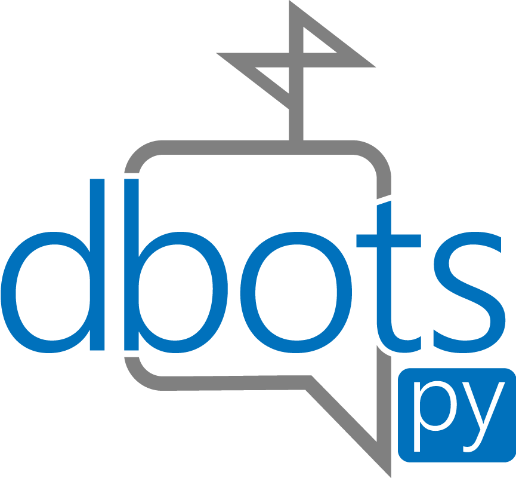

<div align="center">
  <p>
    
  </p>
  <p>A stats poster and API wrapper for all botlists.</p>
  <p>
    <a href="https://www.pypi.org/project/dbots"></a>
    <a href="https://www.pypi.org/project/dbots"></a>
    <a href="https://libraries.io/pypi/dbots"></a>
    <a href="https://dbots.readthedocs.io/en/latest/?badge=latest"></a>
  </p>
</div>
<br/>

<!-- omit in toc -->
# Table of Contents
- [About](#about)
- [Installing](#installing)
- [Examples](#examples)
  - [Example with client](#example-with-client)
  - [Example without client](#example-without-client)
- [Services](#services)
  - [Supported Services](#supported-services)
  - [Adding Custom Services](#adding-custom-services)
  - [Adding a custom post function](#adding-a-custom-post-function)
- [Contribution](#contribution)
- [Other Links](#other-links)

## About
`dbots` helps [Discord](https://discordapp.com) bot developers group all your statistic posting needs into one poster, complete with seperate posting, and a loop to post to all services every `n` seconds.

## Installing
**Python 3.6 or higher is required!**
You can install dbots by running this command:
```sh
# Linux/macOS
python3 -m pip install -U dbots

# Windows
py -3 -m pip install -U dbots
```

To install package from the master branch, do the following:
```sh
git clone https://github.com/dbots-pkg/dbots.py
cd dbots.py
python3 -m pip install -U
```

## Examples

### Example with client
Currently, only `discord.py` is supported as a usable client. (You can use any derivative of `discord.py` as long as it does not interfere with important properties used by `dbots`.)
```py
import discord
import dbots

client = discord.Client()
poster = dbots.ClientPoster(client, 'discord.py', api_keys = {
    'top.gg': '…',
    'discord.bots.gg': '…'
})

@client.event
async def on_ready():
    print('Logged on as', client.user)
    await poster.post()
    # This posts to all lists every 30 minutes
    # You can stop the loop with `poster.kill_loop()`
    poster.start_loop()

@poster.event
async def on_auto_post(response):
    print('Auto-Post:', response)

"""
You can also define the event you want to get by adding an argument to the decorator.

@poster.event('post')
async def some_function(response):
    print(response)
"""
```

### Example without client
```py
import dbots

client_id = '1234567890'
def server_count():
  return 100
def user_count():
  return 100
def voice_connections():
  return 0

# `server_count`, `user_count`, and `voice_connections` can either be regular functions or coroutines
poster = dbots.Poster(client_id, server_count, user_count, voice_connections, api_keys = {
    'top.gg': '…',
    'discord.bots.gg': '…'
})
```

See more examples [here](/examples).

## Services

### Supported Services
 - [arcane-center.xyz](https://arcane-center.xyz) ([docs](https://dbots.readthedocs.io/en/latest/api.html#dbots.Arcane))
 - [botlist.space](https://botlist.space) ([docs](https://dbots.readthedocs.io/en/latest/api.html#dbots.BotListSpace))
 - [botsfordiscord.com](https://botsfordiscord.com) ([docs](https://dbots.readthedocs.io/en/latest/api.html#dbots.BotsForDiscord))
 - [b-o-d.cf](https://b-o-d.cf) ([docs](https://dbots.readthedocs.io/en/latest/api.html#dbots.BotsOfDiscord))
 - [bots.ondiscord.xyz](https://bots.ondiscord.xyz) ([docs](https://dbots.readthedocs.io/en/latest/api.html#dbots.BotsOnDiscord))
 - [carbonitex.net](https://www.carbonitex.net/Discord/bots) ([docs](https://dbots.readthedocs.io/en/latest/api.html#dbots.Carbon))
 - [cloud-botlist.xyz](https://cloud-botlist.xyz) ([docs](https://dbots.readthedocs.io/en/latest/api.html#dbots.CloudBotList))
 - [cloudlist.xyz](https://cloudlist.xyz) ([docs](https://dbots.readthedocs.io/en/latest/api.html#dbots.CloudList))
 - [dblista.pl](https://dblista.pl) ([docs](https://dbots.readthedocs.io/en/latest/api.html#dbots.DBLista))
 - [discord.bots.gg](https://discord.bots.gg) ([docs](https://dbots.readthedocs.io/en/latest/api.html#dbots.DiscordBotsGG))
 - [discordapps.dev](https://discordapps.dev) ([docs](https://dbots.readthedocs.io/en/latest/api.html#dbots.DiscordAppsDev))
 - [discord.boats](https://discord.boats) ([docs](https://dbots.readthedocs.io/en/latest/api.html#dbots.DiscordBoats))
 - [discordbotlist.com](https://discordbotlist.com) ([docs](https://dbots.readthedocs.io/en/latest/api.html#dbots.DiscordBotList))
 - [discordbot.world](https://discordbot.world) ([docs](https://dbots.readthedocs.io/en/latest/api.html#dbots.DiscordBotWorld))
 - [discordextremelist.xyz](https://discordextremelist.xyz) ([docs](https://dbots.readthedocs.io/en/latest/api.html#dbots.DiscordExtremeList))
 - [divinediscordbots.com](https://divinediscordbots.com) ([docs](https://dbots.readthedocs.io/en/latest/api.html#dbots.DivineDiscordBots))
 - [glennbotlist.xyz](https://glennbotlist.xyz) ([docs](https://dbots.readthedocs.io/en/latest/api.html#dbots.GlennBotList))
 - [lbots.org](https://lbots.org) ([docs](https://dbots.readthedocs.io/en/latest/api.html#dbots.LBots))
 - [listmybots.com](https://listmybots.com) ([docs](https://dbots.readthedocs.io/en/latest/api.html#dbots.ListMyBots))
 - [mythicalbots.xyz](https://mythicalbots.xyz) ([docs](https://dbots.readthedocs.io/en/latest/api.html#dbots.MythicalBots))
 - [space-bot-list.org](https://space-bot-list.org) ([docs](https://dbots.readthedocs.io/en/latest/api.html#dbots.SpaceBotsList))
 - [top.gg](https://top.gg) ([docs](https://dbots.readthedocs.io/en/latest/api.html#dbots.TopGG))
 - [wonderbotlist.com](https://wonderbotlist.com) ([docs](https://dbots.readthedocs.io/en/latest/api.html#dbots.WonderBotList))
 - [yabl.xyz](yabl.xyz) ([docs](https://dbots.readthedocs.io/en/latest/api.html#dbots.YABL))

### Adding Custom Services
You can add custom services by extending from the base service class (`dbots.Service`) and overriding the `_post`  and `aliases` method.  
Make sure to add the custom service class to the service keymap. (`dbots.Service.SERVICE_KEYMAP`) An example of adding a custom service can be shown [here](/examples/custom_service.py).

### Adding a custom post function
You can add a custom post event by defining `on_custom_post` in the initialization of a Poster.  
This function can be used when executing `poster.post('custom')` and when all services are being posted to. 
An example of adding a custom post function can be shown [here](/examples/custom_post.py).

## Contribution
Any contribution may be useful for the package! Make sure when making issues or PRs that the issue has not been addressed yet in a past issue/PR.

## Other Links
- [PyPi](https://www.pypi.org/project/dbots)
- [Libraries.io](https://libraries.io/pypi/dbots)
- [Documentation](https://dbots.readthedocs.io/en/latest/index.html)
- [dbots Github Organization](https://github.com/dbots-pkg)